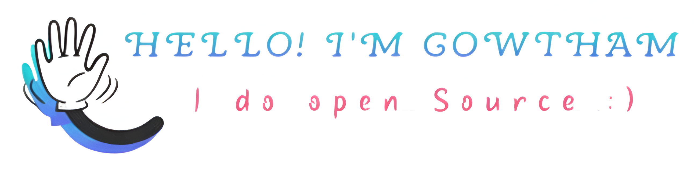

  

I am a passionate Software Developer, currently thriving in the USA. I actively contribute to open-source projects, collaborating globally. Always eager to learn and grow.   <!-- With over two years of experience, I excel in both front-end and back-end development.  -->
 

**About me**

- 💼 Open Source Contributor at [One Community](https://github.com/OneCommunityGlobal/)

- 📈 Built QuickHire and Budget Buddy apps, embracing a learn-by-doing approach.

<!-- - ❤️ I love writing TypeScript, and building fun experiments on type-level -->

- 💬 Ask/Find more about anything [here](https://www.linkedin.com/in/gowthamdongari/)

<code></code>
<code></code>
<code></code>
<code></code>
<code></code>    

|  |  |
| ------------- | ------------- |

#### Top Repositories

 
 

<!-- 
 -->